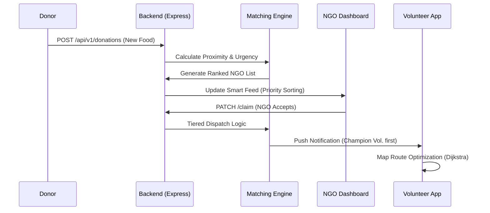
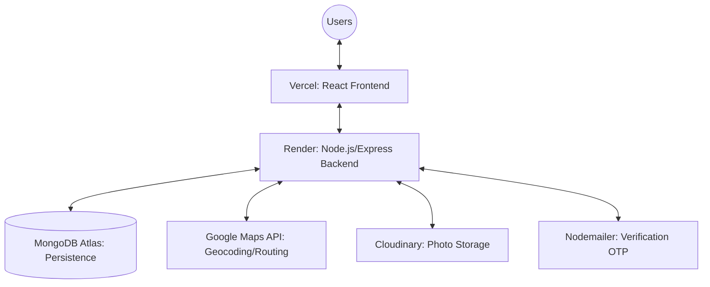
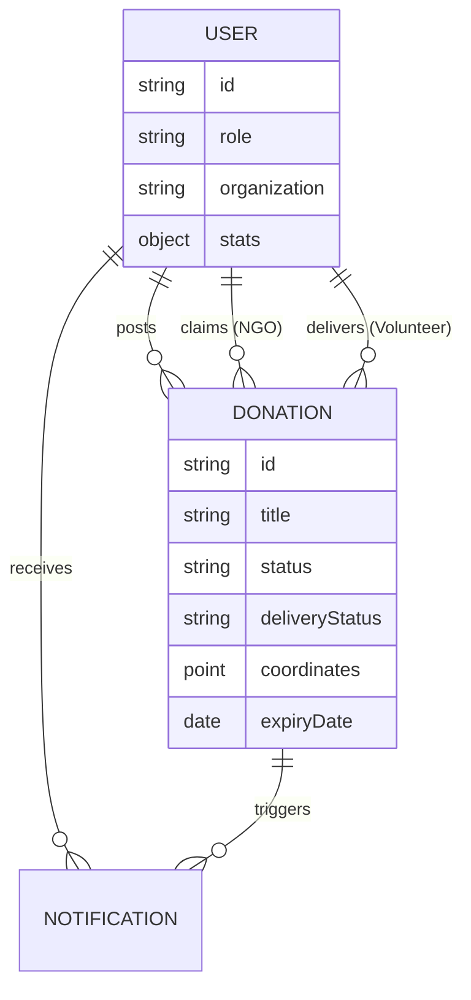

# SurplusLink: Compulsory Diagram Mockups (Mermaid.js)

These diagrams are built using **Mermaid.js**. You can paste these code blocks into the GitHub README, an online [Mermaid Live Editor](https://mermaid.live/), or use a VS Code extension to generate high-quality PNG/SVG exports for your Review.

---

## 1. Use Case Diagram
*Shows the interaction between users and the platform.*

```mermaid
useCaseDiagram
    actor Donor
    actor NGO
    actor Volunteer
    actor Admin

    package "SurplusLink System" {
        usecase "Post Food Donation" as UC1
        usecase "View Smart Feed" as UC2
        usecase "Claim Donation" as UC3
        usecase "Accept Pickup Mission" as UC4
        usecase "Verify Delivery (Photo)" as UC5
        usecase "Monitor Global Logistics" as UC6
        usecase "Approve Organizations" as UC7
    }

    Donor --> UC1
    NGO --> UC2
    NGO --> UC3
    Volunteer --> UC4
    Volunteer --> UC5
    Admin --> UC6
    Admin --> UC7
```

---

## 2. Sequence Diagram (Smart Matching Flow)
*Illustrates the "Brain" logic in action.*



---

## 3. Architecture Diagram
*Technical infrastructure overview.*



---

## 4. Schema Diagram (ERD)
*Core data relationships.*


